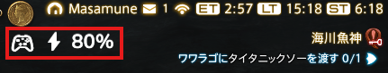

# DS Battery OSD

DualSense / DualSense Edgeの電池残量を、Windowsデスクトップ右上に表示する最小オーバーレイです。



## MVPの動作

- USB / Bluetooth接続を自動検出
- 10%刻みのバッテリー残量と充電状態を表示
- 切断時は自動的に非表示
- 常に最前面、枠なし、背景なし
- 表示領域全体をマウスドラッグで移動（位置は次回起動時に復元）
- Store版は初回起動後、次回のWindowsログインから自動起動
- 20%未満は赤色で表示
- 丸みのあるNunito Boldをアプリへ同梱
- DualSense以外のゲームやプロセスにはアクセスしない

## ビルド

.NET 8 SDKを導入後、次を実行します。

```powershell
dotnet build .\DsBatteryOsd.csproj -c Release
```

起動後、DualSenseを接続すると右上に `🎮 70%` のように表示されます。充電中は `🎮 ⚡ 70%`、充電完了時は `🎮 ⚡ FULL` になります。

DualSenseが満充電ステータスを通知している間は `FULL` と表示します。ケーブルを抜いた直後に80%などへ変わることがありますが、瞬時に放電したのではありません。接続解除後は、コントローラーが通知する段階的な残量値へ表示を切り替えるためです。

### Microsoft Store用パッケージ

自己完結型のx64 MSIXは次のコマンドで生成できます。Storeが配布時に署名するため、生成物自体は未署名です。

```powershell
.\tools\Generate-AppAssets.ps1
.\tools\Build-StorePackage.ps1 -Version 1.0.0.0
```

出力先は `AppPackages\1.0.0.0\DSBatteryOSD_1.0.0.0_x64.msix` です。2回目以降の申請では、前回より大きい4桁のバージョンを指定してください。

Store版の自動起動は、アプリを一度起動すると登録されます。Windowsの「設定 > アプリ > スタートアップ」からいつでも無効にできます。

## フルスクリーン表示について

ウィンドウモードと仮想（ボーダーレス）フルスクリーンに対応しています。

排他的フルスクリーンでは、Windowsの通常ウィンドウよりゲーム画面が優先されるため、本OSDは表示されません。仮想（ボーダーレス）フルスクリーンで使用してください。NVIDIA Appなどのオーバーレイへの統合や、ゲームへのDLL注入は行いません。

## 現時点の範囲

単一コントローラー向けです。設定画面、タスクトレイ、複数台対応はまだ含みません。

## ライセンス

アプリ本体は[MIT License](LICENSE)です。

同梱するNunitoフォントはSIL Open Font License 1.1です。ライセンス全文は[Assets/OFL-Nunito.txt](Assets/OFL-Nunito.txt)を参照してください。

プライバシーに関する取り扱いは[プライバシーポリシー](PRIVACY.md)を参照してください。
